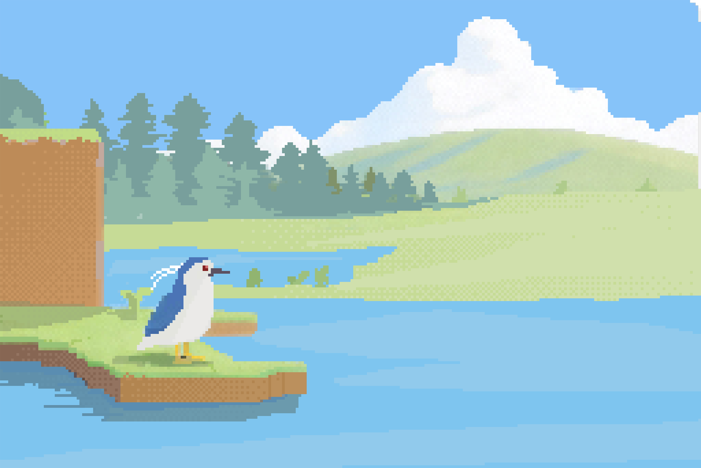
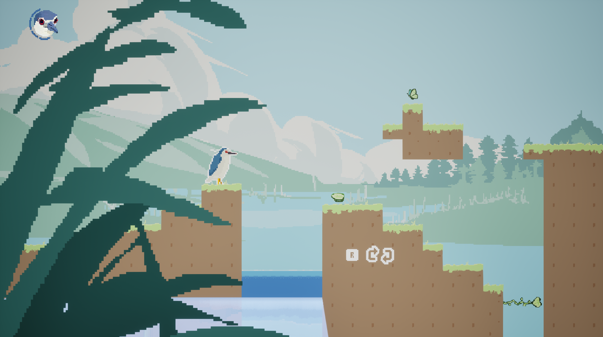
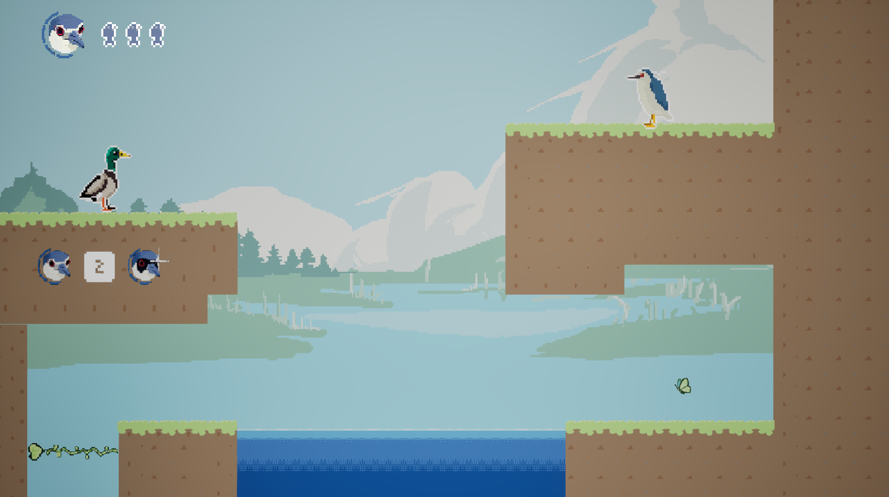
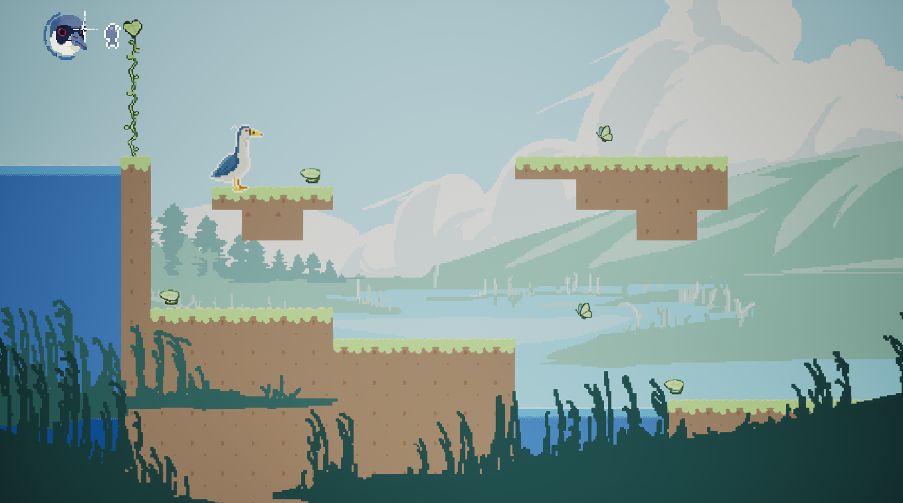
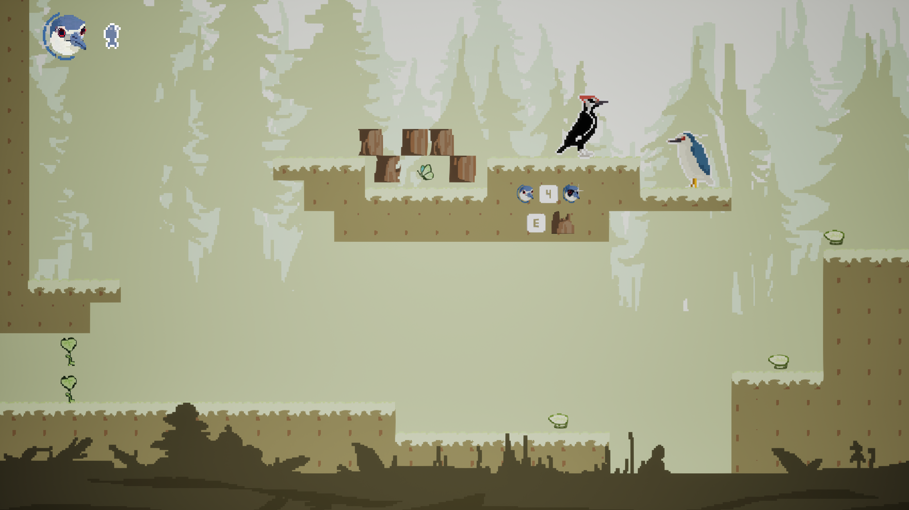
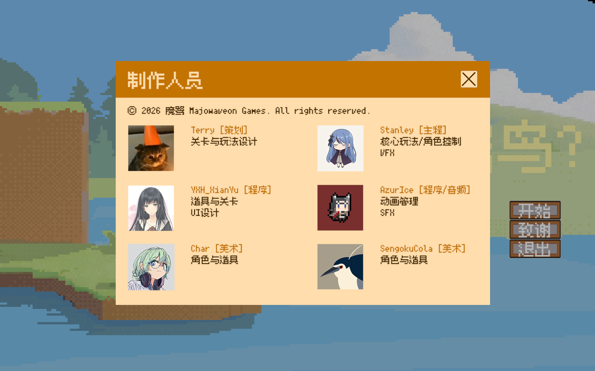

# 啥鸟?! - WhatB?!

Global Gamejam 2026 开发的 2D 动作游戏。当前版本使用 **Godot 4.5.1**，已从原 Unreal Engine 工程迁移；旧 UE 工程和一次性转换工具已归档移出工作区。

## 运行与关卡编辑

- Godot 工程：[godot/project.godot](godot/project.godot)
- Windows 启动器：[play.bat](play.bat)（需要 Godot 4.5.1 在 PATH 中）
- 总地图：[testyxh1.tscn](godot/scenes/maps/testyxh1.tscn)
- 第一房间：[w0l1.tscn](godot/scenes/rooms/w0l1.tscn)，其余房间位于 `godot/scenes/rooms/`
- 美术/策划：[关卡编辑指南](godot/关卡编辑指南.md)
- 程序与操作说明：[Godot README](godot/README.md)
- UE 清理及恢复说明：[归档记录](Docs/UE工程归档.md)

从仓库根目录运行 `godot --path godot`。在编辑器中使用原生 `TileMapLayer` 绘制地形、拖动机关，保存场景后运行生效。不要无备份执行场景生成器的 `--overwrite`，它会覆盖关卡编辑。

## 介绍 - Description

### CN

人类在面对不同的人的时候，会带上不同的面具，或热情，冷静亦或是高深莫测。 

鸟也一样，

现在有请我们的 鸟中豪杰/企鹅/黑白大枣核/沉思水鸟/超级变变变/夜师傅/钓鱼佬/阴暗蟑螂 ！ 

夜鹭，以其模仿其他鸟类（尤其是企鹅），圆滚和可动的伸缩脖子闻名。 

在我们的游戏中，夜鹭将会如同人类带上伪装的面具，变换成不同的鸟类形态，戴上假面，发挥不同鸟类的独特技能越过冒险路上的阻碍和困难。

 —————————————————————————— 

变成绿头鸭？获得高超的游泳能力！

变成啄木鸟？击碎你眼前的障碍！

变成企鹅？在冰面上滑行和跳跃！

或者做夜鹭自己，进行跳跃和滑翔！

### English

Let this night heron disguise as different birds (mallard duck/woodpecker/penguin) and interact with the mechanisms in the scene, experiencing a unique bird life through jumping and puzzle-solving.

## 截图 - Screenshots

## 开发人员 - Credits

